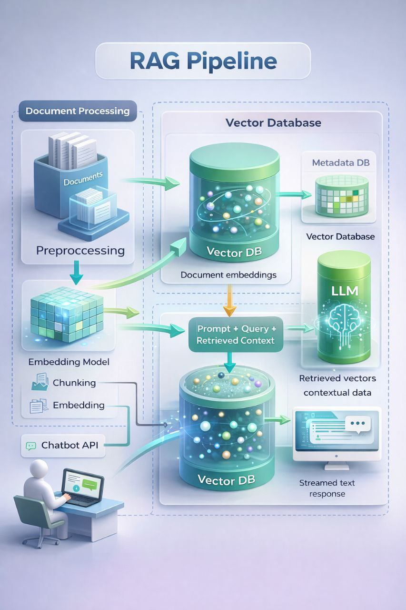

# 🩺 MedicalGPT — Interactive Medical Chatbot (RAG-based)

An interactive TERMINAL-BASED MedicalGPT chatbot built using LangChain + OpenRouter.
This project uses real medical PDFs and Retrieval-Augmented Generation (RAG).

⚠️ EDUCATIONAL PURPOSE ONLY  
❌ No diagnosis  
❌ No prescriptions  

---

## ✨ What this project does

- Loads medical PDFs (OpenStax / WHO / textbooks)
- Splits large documents into chunks
- Uses context-based prompting (RAG)
- Runs an interactive chat in terminal
- No web UI, no frontend, pure Python

---

## 📁 Project Directory Structure

MedicalGPT/
├── data/
│   └── anatomy_phys_vol2.pdf
│
├── src/
│   ├── main.py                  # LLM API connectivity test
│   ├── test_rag_step1.py        # Vector store / environment sanity check
│   ├── test_rag_step3_llm.py    # Single-shot RAG test
│   └── medicalgpt_chat.py       # FINAL interactive chatbot
│
├── chroma_db/                   # (Optional / experimental)
├── venv/
├── requirements.txt
└── README.md

---

## 🔧 Prerequisites

- Python 3.10+
- Internet connection
- OpenRouter API key

---

## 🚀 Step 1 — Create Virtual Environment

python -m venv venv

### Activate venv

Windows:
venv\Scripts\activate

Mac / Linux:
source venv/bin/activate

---

## 📦 Step 2 — Install Dependencies

pip install langchain langchain-openai langchain-community langchain-text-splitters langchain-chroma chromadb pypdf

(Optional)
pip freeze > requirements.txt

---

## 🔑 Step 3 — API Key Setup (OpenRouter)

1. Create account at https://openrouter.ai
2. Generate API key

Set environment variable:

Windows:
setx OPENAI_API_KEY "your_openrouter_api_key"

Mac / Linux:
export OPENAI_API_KEY="your_openrouter_api_key"

WHY OpenRouter?
- Avoids paid OpenAI credits
- Free-tier access to strong LLMs
- OpenAI-compatible API

---

## 🤖 Step 4 — Test LLM Connectivity

File: src/main.py

Purpose:
- Verify API key
- Verify LangChain → LLM connection

Run:
python src/main.py

If this fails, STOP and fix API issues first.

---

## 📄 Step 5 — Add Medical PDF

1. Download a medical PDF (OpenStax / WHO / textbook)
2. Place it inside:

data/anatomy_phys_vol2.pdf

This project used OpenStax Anatomy & Physiology (≈500 pages).

---

## ✂️ Step 6 — Chunking (VERY IMPORTANT)

WHY chunking?
- LLMs cannot process entire books
- Chunking divides large text into semantic batches

We used:
- chunk_size = 500
- chunk_overlap = 100

Engineering tradeoff:
- Large enough for context
- Small enough for precise retrieval

500+ pages → ~2000–4000 chunks

Chunking is similar to batching in ML.

---

## 🧠 Step 7 — RAG without Vector DB (Manual Context)

Instead of sending full document to LLM:
- Select relevant chunks
- Combine into a CONTEXT string
- Force model to answer ONLY from context

Prompt rules:
- If answer not found → say “I don’t know”
- No diagnosis
- No medication

This reduces hallucination.

---

## 🧪 Step 8 — Test RAG (Single Question)

File: src/test_rag_step3_llm.py

Run:
python src/test_rag_step3_llm.py

Expected output:
- Pages loaded
- Chunks created
- Answer generated from document context

This confirms RAG works.

---

## 💬 Step 9 — Interactive MedicalGPT Chatbot (FINAL)

File: src/medicalgpt_chat.py

Run:
python src/medicalgpt_chat.py

Terminal output:
MedicalGPT starting...
Type 'exit' or 'quit' to stop.

Ask questions like:
- What is anatomy?
- What does physiology study?
- What is the skeletal system?

Exit:
exit

---

## 🛡️ Safety Constraints (Built-in)

- ❌ No diagnosis
- ❌ No prescriptions
- ✅ Educational answers only
- ✅ Context-grounded responses

---

## 🧠 Core Concepts Learned

- What is RAG and why we use it
- Why chunking is mandatory
- How chunk size affects retrieval
- Difference between embeddings and LLMs
- Why embeddings handle similarity
- Why LLMs handle generation
- How to reduce hallucinations
- Engineering tradeoffs in real systems

Embeddings ≠ LLM  
They solve different problems.

---

## 🧪 Vector Database Note

Vector DBs (ChromaDB) were explored.
Due to free-tier and OS constraints, runtime vector search was avoided.

Can be reintroduced later using:
- FAISS
- Pinecone
- Weaviate

Architecture remains RAG-compliant.

---

## 📌 Future Improvements

- Conversation memory
- Better chunk retrieval
- FAISS integration
- Web UI (Streamlit / FastAPI)
- OCR cleanup for PDFs

---

## 📜 License

Educational / personal learning use.

---

## 🧑‍💻 Author Notes

This project was built step-by-step to:
- understand RAG deeply
- debug real-world issues
- learn practical AI engineering

This is NOT a tutorial copy-paste project.
This is a learning-first build.

